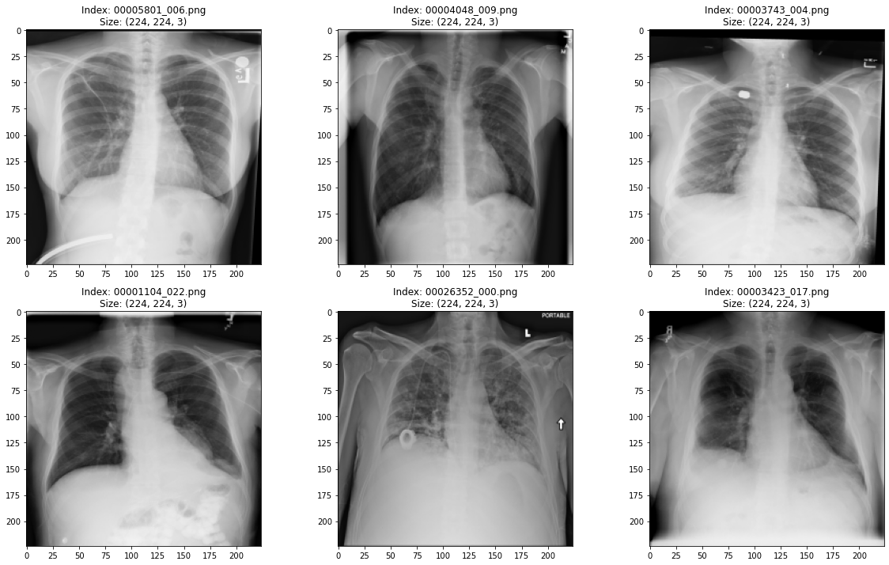
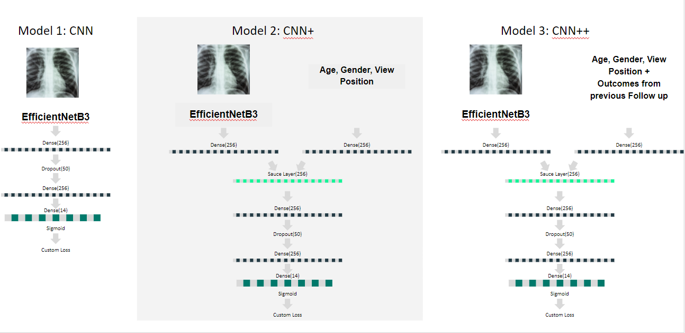
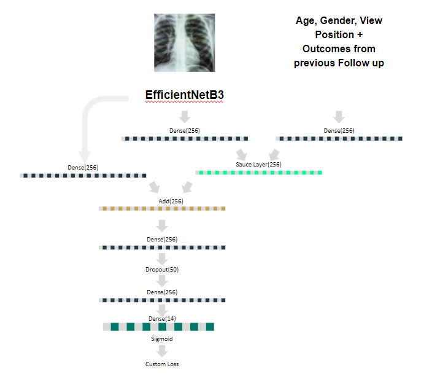

# Project: Machine Learning for Medical Diagnosis
## Focus: Using CNNs for X-Ray Images

### Introduction

X-rays are the most commonly accessible radiological examinations for screening and diagnosis of lung diseases. There is a large number of X-ray images in hospitals, accompanied by radiological reports, but this data is not organized in a way that can be used for modern diagnostic methods, namely, Machine Learning and Deep Learning techniques. Such techniques are widely used for image recognition and classification, but they require images to be associated with relevant class labels.

In their 2017 paper, [Wang et al.](https://arxiv.org/abs/1705.02315) describe the creation of such a database (ChestX-ray8) and its use in Deep Learning for disease detection and spatial location. This database consisted of more than 100,000 X-ray images (from the PACS hospital systems), spanning more than 30,000 patients. Eight associated disease labels were extracted for every image by means of text-mining of radiological reports using Natural Language Processing (NLP) methods. The dataset size has increased since its first official description and as of now, it comprises 112,120 frontal-view X-ray images of 30,805 unique patients with the text-mined 14 disease image labels, as well as a label for ‘No finding’. The thoracic pathologies associated with the X-ray images are an extension of the 8 common disease patterns listed in the original paper.

In this project, we will make use of the ChestX-ray8 database to investigate machine learning methods for disease detection from chest X-ray images.

### Dataset Details

The dataset was downloaded from the provided location. The files were downloaded and the compressed files that contained the images were expanded.

The dataset provided a text files with the file names of images in the train/validation set and test set.

The dataset consists of

- Chest X-ray images: 112120 images from 30805 unique patients, stored in compressed folders.
- Information on the pathologies detected for each image (identified by the file name), as well as the unique patient ID, the age and sex of the patient, the follow-up number (first visit is 0 and follow-up numbers are 1,2 etc) and some imaging details, such as original image size and pixel spacing and view position (posterior-anterior or anterior-posterior).
- Files with the file names of images that belong to the train/validation set and the test set. The split was performed on the patient level and images from one patient only appear in one of the two groups.
- A file with information of the bounding boxes to identify the pathology for about 1000 images.

In the dataset ChestX-ray8, X-ray images were directly extracted from the DICOM file and resized as 1024x1024 bitmap images. Their intensity ranges were rescaled using the default window settings stored in the DICOM header files.

### Modeling

#### Custom Loss Function

In practice, as well as in our dataset, there can be more than one label (pathology) assigned to an image. Thus, we are dealing with a multi-class, multi-label problem. Additionally, since the dataset is not balanced, we needed to ensure that the loss function of our model accounts for the different frequency labels appearing in the dataset. To solve for these, we built a custom loss function.

To deal with the class imbalance, this loss function assigns a different weight to the positive and negative instances of each label, giving higher weight to the less frequent values. To accommodate the requirement of assigning multiple labels per image, we average the weighted loss per class and we aim to minimize the sum of the loss of all classes.

#### Transfer Learning

Instead of creating and training a CNN model from scratch, we decided to use transfer learning and modify already trained, state of the art deep neural networks to suit our task.

The models we chose to train are:
- DenseNet121
- VGG19
- Resnet50
- InceptionV3
- MobileNetV2
- EfficientNetB3

**Approach:** We have trained models with the same architecture, only having different pre-trained CNN model, for a limited number of epochs (5). Then, we have compared the basic metrics for the performance of these models on the test set in order to make an informed choice of the pre-trained model to use.

For each of the models, we removed the last layer and added two fully connected layers. The output of each model passed through a Dense layer with 256 units, with a dropout rate of 0.5, and then another Dense layer with 256 units. This was the input to the classifier of the model, with 15 units and sigmoid activation.

We used the sigmoid activation function of the last fully connected layer, to allow for the prediction of multiple labels. In contrast with softmax, sigmoid activation does not result in predictions with probabilities that add up to 1. We trained each model for 10 epochs, using EarlyStopping with patience=3. We used Adam optimizer, with all the default settings but with learning rate=0.0001.

To faciliate easier reruns during our testing, we saved the weights of each of the model we have trained in a h5 file. Additionally, we have also saved the training histories of the models in a pickle file.

#### Final Model Architecture

After selecting the pretrained model we would use for image classification, we followed several strategies to improve its performance. To train these models, we dropped the ‘No finding’ label (and calculated new class weights) and we changed the last pooling layer of the pretrained model from the default average pooling to max pooling.

Our first approach towards improving the model’s performance was to run it for a larger number of epochs. We then added to this by providing additional information for each image.

To this end, we trained the model with two additional datasets.
- The first consists of the images and demographic characteristics of the patients (age, gender) and the image’s view position
- The second expands on the first by adding the true output labels from the previous visit, when available.

The images were processed by the pretrained model as described in previous section, and the output was passed through a Dense layer with 256 units. The categorical variables were passed through a different Dense layer with 256 units. The outputs of these two Dense layers were then combined into a “Sauce” layer that is trained with the model to weight the information of the two different inputs. This layer was inspired by the applications of Natural Language Processing in class CS109B. Finally, the output of the “Sauce” layer is passed through a Dense layer with 256 units and Drop out rate of 0.5, and this goes through the classifier layer that will output the probability of each label being assigned to the image.

A visual representation of the models is shown below.

Unfortunately, using Gradcam Maps, we noticed that in a lot of cases, there are no gradients recorded in the last CNN layer - this was apparent from the fact that the GradCam heatmaps have not highlighted any areas of the images.

To resolve this, we decided to retrain the model using a residual layer connection from the CNN outputs to skip the Sauce Layer thereby enabling better flow of gradients.

### Final Reflections

For this project, we worked with a large dataset of chest X-ray images and the accompanying patient and image information, to predict the pathologies/labels assigned to each X-ray image. This was a multiclass problem, as there were 15 labels in total, as well as a multi-label problem, as one image could be associated with multiple labels. The dataset was proven to be highly imbalanced with almost half the images classified as “No Finding”.

To address the complexity of the task, we used a custom loss function that minimizes the total average loss. Instead of designing and training a deep neural network from scratch, we used transfer learning and compared 6 pretrained state-of-the art models. We investigated a few different architectures and we concluded that using EfficientNetB3 for the convolutional part of the network, in combination with patient and image characteristics and a residual connection between the Dense layers and the last Convolutional layer produced the lowest validation loss. We then proceeded to train the weights of EfficientNetB3, which further improved our validation loss and f1-score. Finally, we used Gradcam to visualize what our model focuses on to make a prediction.

Despite the satisfactory metric values of our model, the accuracy is not very high. We had several thoughts regarding steps that could be taken to improve the accuracy of the classifier, namely,
- First of all, we could not perform an extensive data augmentation encompassing all pathologies due to limited time, but in the future, data augmentation could be performed for all labels, and potentially, the “No Finding” label could be undersampled.
- Also, potentially, an alternative approach to the custom loss function could be introduced in order to increase the model accuracy.
- Bounding boxes could be made available in the training set to provide better guidance to the model.
- Finally, additional patient information, such as medical history and symptoms, among others, would bring very powerful information to help the model make better predictions.

**Project Collaborators:**
[Maria Kalimeri](https://github.com/mkalimeri)
[James Franco](https://github.com/jifdata)
[Venkataraman Muthuramalingam](https://github.com/devfulcrum)
[Sahil Sakhuja](https://github.com/sahilsakhuja)
